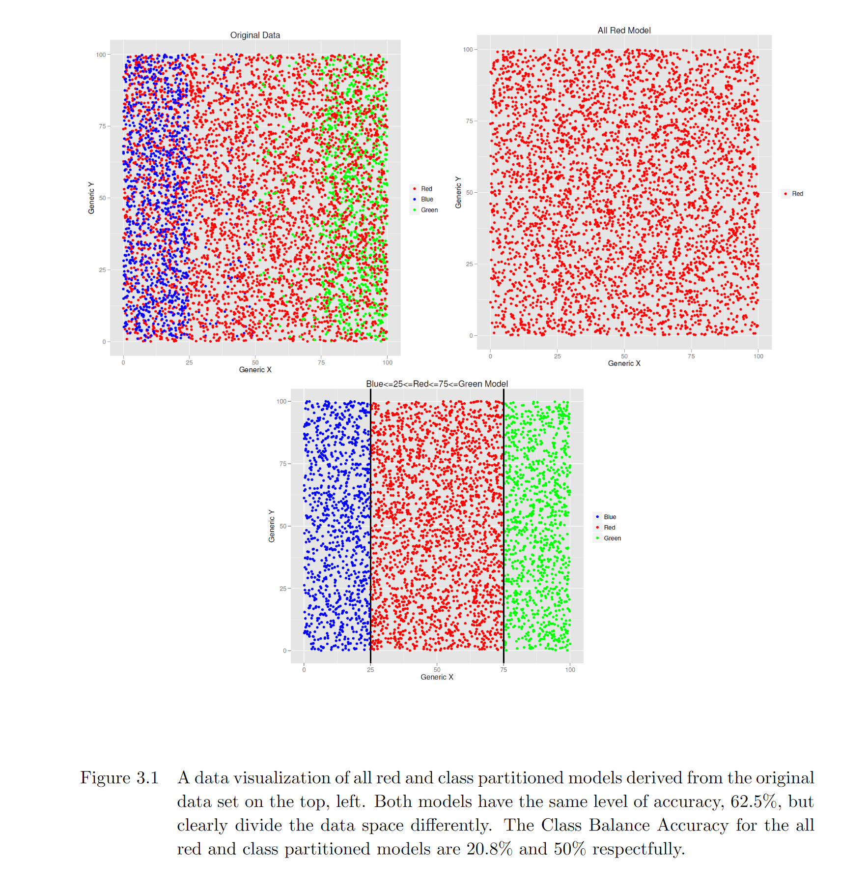

# A Balanced Approach to the Multi-Class Imbalance Problem 

From the original abstract: “The multi-class class-imbalance problem is a subset of supervised machine learning tasks where the classification variable of interest consists of three or more categories with unequal sample sizes. In the fields of manufacturing and business, common machine learning classification tasks such as failure mode, fraud, and threat detection often exhibit class imbalance due to the infrequent occurrence of one or more event states. Though machine learning as a discipline is well established, the study of class imbalance with respect to multi-class learning does not yet have the same deep, rich history. In its current state, the class imbalance literature leverages the use of biased sampling and increasing model complexity to improve predictive performance, and while some have made advances, there are still no standard model evaluation criteria for which to compare their performance. In the presence of substantial multi-class distributional skew, of the model evaluation criteria that can scale beyond the binary case, many become invalid due to their over-emphasis on the majority class observations. Going a step further, many of the evaluation criteria utilized in practice vary significantly across the class imbalance literature and so far no single measure has been able to galvanize consensus due not only to implementation complexity, but the existence of undesirable properties. Therefore, the focus of this research is to introduce a new performance measure, Class Balance Accuracy, designed specifically for model validation in the presence of multi-class imbalance.”

As a survey of the multi-class imbalance literature, “A Balanced Approach to the Multi-Class Imbalance Problem” has helped students, researchers and machine learning enthusiasts gain a fundamental understanding of how to both identify and account for imbalance in their classification tasks. As a testament to its influence, the Class Balanced Accuracy measure proposed in this thesis has been rederived, utilized and cited across multiple publications in influential journals such as Pattern Recognition, Expert Systems with Applications, and Knowledge Based Systems.  At the time this dissertation was drafted, it was indeed true that the study of the multi-class imbalance did not have a “deep, rich history”, nor was there much emphasis placed on alternative model evaluation criteria that could account for class imbalance while scaling beyond the binary class case.  Today, that is not so and because of the recent developments in imbalance mitigation techniques, we’d like for this repository to serve as a resource for modern approaches to solving the multi-class imbalance problem.

## Recommended Citation:
L. Mosley, *A Balanced Approach to the Multi-class Imbalance Problem*. PhD thesis, Iowa State University, 2013.

## Publications and Applications Citing this Research:
### Multi-Class Model Evaluation
* The impact of class imbalance in classification performance metrics based on the binary confusion matrix
   * Author: Amalia Luque
   * Journal: Pattern Recognition
* Relevance-based Evaluation Metrics for Multi-class Imbalanced Domains
   * Author: Paula Branco
   * Journal: UAAD and DCC
* Beyond AP: a new evaluation index for multiclass classification task accuracy 
   * Author: Kaifang Zhang et al.
   * Journal: Springer
* Performance Analysis of Binarization Strategies for Multi-Class Imbalanced Data Classification
   * Author: Micha l Zak et al.
   * Journal: ICSS
* The impact of class imbalance in classification performance metrics based on the binary confusion matrix
   * Author: Amalia Luquea et al.
   * Journal: Elsevier

### Machine Learning
* Prediksi curah hujan melalui model statistic menggunakan classification and regression trees dengan processing principal component analysis
   * Author: Ulul Azmi
   * Journal: Tugars askhir
* An in-depth comparison of methods handling mixed-attribute data for general fuzzy min-max neural network
   * Author: Thanh Tung Khuata et al.
   * Journal: NSW
* An Online Learning Algorithm for a Neuro-Fuzzy Classifier with Mixed-Attribute Data
   * Author: Thanh Tung Khuata et al.
   * Journal: IEEE
* Development of Robust and Scalable Hyperbox based Machine Learning Algorithms
   * Author: Thanh Tung Khuata et al.
   * Journal: Sydney
* Surface-Related Features Responsible for Cytotoxic Behavior of MXenes Layered Materials Predicted with Machine Learning Approach
   * Author: Maciej E. Marchwiany et al.
   * Journal: MDPI
* Scalable-effort classifier for energy efficient machine learning
  * Author: Shoaib et al.
  * Journal: United state patent

### Sampling Techniques
* Hybrid approach redefinition-multi class with resampling and feature selection for multi-class imbalance with overlapping and noise
   * Author: Erianto Ongko1 et al.
   * Journal: Bulletin of Electr Eng & Inf
* Evaluation of oversampling data balancing techniques in the context of ordinal classification
   * Author: Ines Domingues et al.
   * Journal: IEEE

### Theoretical Understanding
* Study of Multi-class classification algorithms' performance on highly imbalance network intrusion datasets
   * Author: Victoras Bulavas et al.
   * Journal: Informatica
* Imbalance accuracy metric for model selection in multi-class imbalance classification problems
   * Author:Ebrahim Mortaz
   * Journal: Elsevier
* Label Imputation for Homograph Disambiguation- Theoretical and Practical Approaches
  * Author: Jen Seale
  * Journal: Thesis

### Deep Learning
* A Graphic Encoding Method for Quantitative Classification of Protein Structure and Representation of Conformational Changes
    * Author: Hector Carrillo-Cabada et al. 
    * Journal: IEEE
* Using Deep Convolutional Neural Networks for the Identification of Informal Settlements to Improve a Sustainable Development in Urban Environments
   * Author: Thomas stark
   * Journal: Techische university munchen

### Applications

#### Finance
* Detection of debit card fraud through random forest 
    * Author: Kasm Aksoy
    * Journal: ISTETMD
* Characterisation of survivability resilience with dynamic stock interdependence in financial networks
   * Author: Tang, Junqing
   * Journal: Applied Network Science
* Deep learning modelling of thte limit order book: A comparative perspective
   * Author: Antonio Briola
   * Journal: UCL
* Bargain in the diamond market, how to take advantage from online information
  * Author: Angel Arcocs-Vagas
  * Journal: Wiley Expert Systems
   
#### Medicine and Healthcare
* Model selection for metabolomics: predicting diagnosis of coronary artery disease using automated machine learning
   * Author: Alena Orienko et al.
   * Journal: Bulletin of Electr Eng & Inf
* Sickle-cell disease diagnosis support selecting the most appropriate machine learning method: Towards a general and interpretable approach for cell morphology analysis from microscopy images.
   * Author: Natasa Petrovic
   * Journal: Balearic Islands (IdISBa)
* Investigating Various Approaches in Classification of EEG Signals Representing Distinct Cognitive States to Reach an Optimal Solution
   * Author: Soroush Mirjalili
   * Journal: Georgia Institute of Technology
* Short-term prediction of opioid prescribing patterns for orthopaedic surgical procedures: a machine learning framework
   * Author: Ebrahim Mortaz
   * Journal: Taylor & Francis
* Evaluation criteria for closed-loop adaptive dynamic discrete-continuous brain-computer interfaces: clinical study case with tetraplegic patient.
   * Author: Felix Martel et al.
   * Journal: IEEE
* HIV Patients’ Tracer for Clinical Assistance and Research during the COVID-19 Epidemic (INTERFACE): A Paradigm for Chronic Conditions
   * Author: Antonella Cingolani et al,
   * Journal: MDPI
* Listening to Mental Health CrisisNeeds at Scale: Using Natural Language Processing to Understand and Evaluate a Mental Health CrisisText Messaging Service
  * Author: Zhaolu Liu
  * Journal: Frontier in digital health
* Use of Patient-Reported Symptoms from an Online Symptom Tracking Tool for Dementia Severity Staging: Development and Validation of a Machine Learning Approach.
   * Author: Aaqib Shehzad et al.
   * Journal: XSL

#### IoT and Smart Meters
* Road Surface Wetness Quantification Using a Capacitive Sensor System
   * Author: Jakob Doring et al.
   * Journal: IEEE
* A Hidden Markov Model for Distinguishing between RFID-tagged Objects in Adjacent Areas
   * Author: Matthias Hauser
   * Journal: IEEE
* Boosting Intelligent Data Analysis in Smart Sensors by Integrating Knowledge and Machine Learning
   * Author: Piotr Łuczak
   * Journal: MDPI
* Supervised Machine Learning Approaches on Multispectral Remote Sensing Data for a Combined Detection of Fire and Burned Area
   * Author: Janine Florath et al.
   * Journal: MDPI

#### Ecology
* Knowledge-Based Classification of Grassland Ecosystem Based on Multi-Temporal WorldView-2 Data and FAO-LCCS Taxonomy
   * Author: Maria Adamo et al.
   * Journal: MDPI
* Predicting wildfire burns from big geodata using deep learning
   * Author: John Ray Bergado et al.
   * Journal: Elsevier

#### Materials Science
* Predicting the cytotoxicity of MXenes - layered materials - using machine learning methods.
   * Author: Maciej E. Marchwiany et al.
   * Journal: Research Square 

#### Object Detection and Imagery
* Improving concave point detection to better segment overlapped object in images
  * Author: Miquel Miro-Nicolau et al.
  * Journal: Arxiv
* High resolution cube-sat imagery and machine learning for detailed snow-covered area
   * Author: Anthony Cannistra et al.
   * Journal: Elsevier
* SAR Image Feature Analysis for Slum Detection in Megacities
   * Author: Matthias weigand 
   * Journal: University of ausburg
* Fairness Properties of Face Recognition and Obfuscation Systems
   * Author: Harrison Roseberg et al.
   * Journal: ACM
* Exploring machine learning for disease assessment from high-resolution UAV imagery
   * Author: Francisco Arias Rojas
   * Journal: Wageningen, the Netherlands

#### Software Packages
* Multi-Imbalance: an open-source software for multi-class imbalance learning
   * Author: Chongsheng Zhanga et al.
   * Journal: KBS
* Intelligence – based decision support system for diagnosing the incidence of hypertensive type
   * Author: M. Ambikaa
   * Journal: IEEE
* Smartphone- and Smartwatch-Based Remote Characterisation of Ambulation in Multiple Sclerosis During the Two-Minute Walk Test
   * Author: Andrew P. Creagh
   * Journal: IEEE

#### General
* Quantitative Assessment of Resilience in Complex Systems
   * Author: Tang, Junqing
   * Journal: Imperial college, London 
* Incremental Inference on Higher-Order Probabilistic Graphical Models Applied to Constraint Satisfaction Problems
   * Author: Simon Frederik Streicher
   * Journal: Stellenboch university 

## Online Resources:

### Software
* https://github.com/chongshengzhang/Multi_Imbalance

### Articles
* https://machinelearningmastery.com/multi-class-imbalanced-classification/

